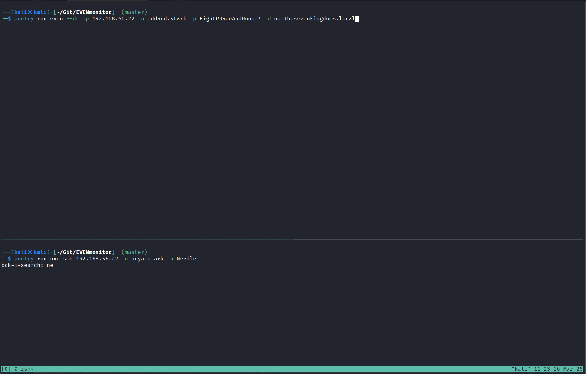

# EVENmonitor

`EVENmonitor` is a lightweight tool for monitoring Windows Event Logs remotely over MS-EVEN6 RPC.
It retrieves event data from a target and parses the returned XML into readable output.

The tool is aimed at security researchers, pentesters, and red/blue/purple team operators who want to observe how activity is captured in Windows logs during assessments.
Inspired by `LDAPmonitor`, it enables fast, real-time event filtering.

Features:

- Streams live events from a remote host (default channel: `Security`)
- Supports Kerberos, password, NT hash, or AES key authentication
- Filters by event IDs and grep-like string matching

## Install

Install pipx following the instructions at https://pipx.pypa.io/stable/installation/#installing-pipx and then run:

```bash
pipx install git+https://github.com/NeffIsBack/EVENmonitor
```

## Usage

```bash
EVENmonitor --dc-ip <TARGET_IP> -u <USER> -p <PASSWORD> -d <DOMAIN>
even --dc-ip <TARGET_IP> -u <USER> -p <PASSWORD> -d <DOMAIN>  # Short version
```

### Options

#### Event filtering

- `--channel Security|System|...` choose event log channel
- `--event-id 4624,4625,4688` filter specific event IDs
- `--grep <STRING>` show only events containing a string

#### Authentication

- `-k --kerberos` use Kerberos auth
- `--kdcHost <HOST>` FQDN of KDC for Kerberos auth
- `-H [LMHASH:]NTHASH`
- `--aes-key <HEX>`

#### Output
- `--header-only` print only event headers (timestamp, ID, level, keyword, task)
- `--debug` include raw formatted XML output
- `--no-color` disable colored output
- `--logfile <FILE>` also write output to a file

## Example workflows

Failed/successful logons:

```bash
EVENmonitor --dc-ip 10.0.0.10 -u alice -d corp.local -p 'Passw0rd!' --event-id 4624,4625
```

Watch process creation artifacts:

```bash
EVENmonitor --dc-ip 10.0.0.10 -u alice -d corp.local -p 'Passw0rd!' --event-id 4688 --grep powershell
```

## Demo

